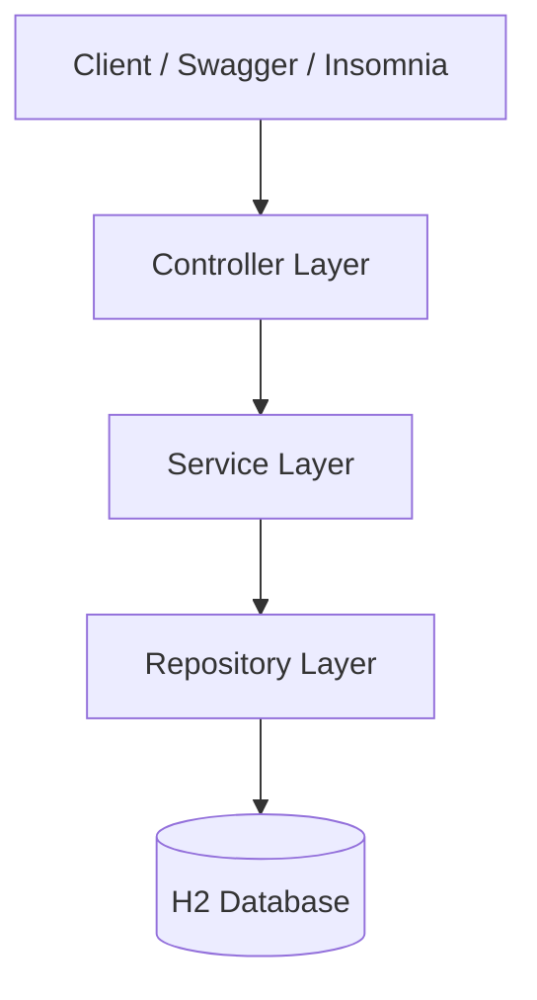

# Empreendimentos SC API


API REST desenvolvida em **Kotlin + Spring Boot** para gerenciamento de empreendimentos.

O projeto demonstra boas práticas de desenvolvimento backend, incluindo **arquitetura em camadas**, **validação de dados**, **paginação**, **tratamento global de erros**, **testes automatizados** e **documentação OpenAPI/Swagger**.

---

# ? Quick Start

Para rodar a API rapidamente:

```bash
git clone https://github.com/SEU-USUARIO/empreendesc-api.git
cd empreendesc-api
./gradlew bootRun
```

Abra no navegador:

```
http://localhost:8080/swagger-ui/index.html
```

A partir do Swagger você já pode **testar todos os endpoints da API**.

---

# Tecnologias Utilizadas

* Kotlin
* Spring Boot
* Spring Data JPA
* H2 Database
* Jakarta Validation
* Gradle
* OpenAPI / Swagger
* REST API

---

# Arquitetura do Projeto

A aplicação segue uma arquitetura em camadas para separar responsabilidades e facilitar manutenção.



---

# Estrutura de Pacotes

```
br.com.empreendesc
 ??? controller
 ??? service
 ??? repository
 ??? domain
 ??? dto
 ??? mapper
 ??? exception
 ??? config
```

### Responsabilidades

**Controller**

* Exposição dos endpoints REST
* Recebimento das requisições HTTP

**Service**

* Contém a lógica de negócio da aplicação

**Repository**

* Acesso aos dados usando Spring Data JPA

**Domain**

* Entidades e enums do domínio

---

# Funcionalidades

* CRUD completo de empreendimentos
* Paginação de resultados
* Filtros por município
* Filtros por segmento
* Validação automática de dados
* Tratamento global de exceções
* Logs de operações
* Documentação automática com Swagger
* Testes automatizados de Controller e Service
* Dados de exemplo carregados automaticamente

---

# Executando o Projeto

## Pré-requisitos

* Java 17+
* Gradle

---

## Rodar a aplicação

```bash
./gradlew bootRun
```

ou execute a classe:

```
EmpreendescApiApplication
```

A aplicação será iniciada em:

```
http://localhost:8080
```

---

# ? Documentação da API (Swagger)

Após iniciar a aplicação, acesse a documentação interativa da API:

```
http://localhost:8080/swagger-ui/index.html
```

No Swagger é possível:

* visualizar todos os endpoints
* testar requisições diretamente no navegador
* visualizar exemplos de request e response
* consultar schemas da API

---

# Endpoints da API

## Criar empreendimento

POST `/empreendimentos`

Exemplo de request:

```json
{
  "nome": "Tech Startup",
  "nomeEmpreendedor": "Maria Silva",
  "municipio": "Florianopolis",
  "segmento": "TECNOLOGIA",
  "contato": "contato@empresa.com",
  "status": "ATIVO"
}
```

---

## Listar empreendimentos

GET `/empreendimentos`

Suporte a paginação:

```
GET /empreendimentos?page=0&size=10
```

---

## Filtrar por município

```
GET /empreendimentos?municipio=Florianopolis
```

---

## Filtrar por segmento

```
GET /empreendimentos?segmento=TECNOLOGIA
```

---

## Buscar por ID

```
GET /empreendimentos/{id}
```

---

## Atualizar empreendimento

```
PUT /empreendimentos/{id}
```

---

## Remover empreendimento

```
DELETE /empreendimentos/{id}
```

---

# Tratamento de Erros

A API possui tratamento global de exceções retornando respostas padronizadas.

Exemplo:

```json
{
  "timestamp": "2026-03-11T10:30:00",
  "status": 404,
  "error": "Not Found",
  "message": "Empreendimento não encontrado",
  "path": "/empreendimentos/99"
}
```

---

# Validação de Dados

Campos obrigatórios são validados automaticamente usando **Jakarta Validation**.

Exemplo de erro de validação:

```json
{
  "status": 400,
  "error": "Validation Error",
  "message": "nome: não deve estar em branco"
}
```

---

# Banco de Dados

O projeto utiliza **H2 Database em memória**, facilitando execução e testes.

Dados de exemplo são carregados automaticamente na inicialização da aplicação.

---

# Testes Automatizados

O projeto inclui testes automatizados para:

* Controller (MockMvc)
* Service (Mockito)

Execute os testes com:

```bash
./gradlew test
```

---

# Future Improvements

Algumas melhorias que poderiam ser implementadas em uma evolução futura do projeto:

* Implementação de autenticação e autorização (Spring Security / JWT)
* Integração com banco de dados persistente (PostgreSQL ou MySQL)
* Versionamento de API
* Containerização com Docker
* Integração contínua (CI/CD)
* Monitoramento com Actuator e Prometheus
* Testes de integração com Testcontainers

---

# Objetivo do Projeto

Este projeto foi desenvolvido como **desafio técnico para avaliação de habilidades em desenvolvimento backend**, demonstrando:

* organização de código
* boas práticas de API REST
* arquitetura em camadas
* uso de Spring Boot com Kotlin
* testes automatizados
* documentação OpenAPI

---
